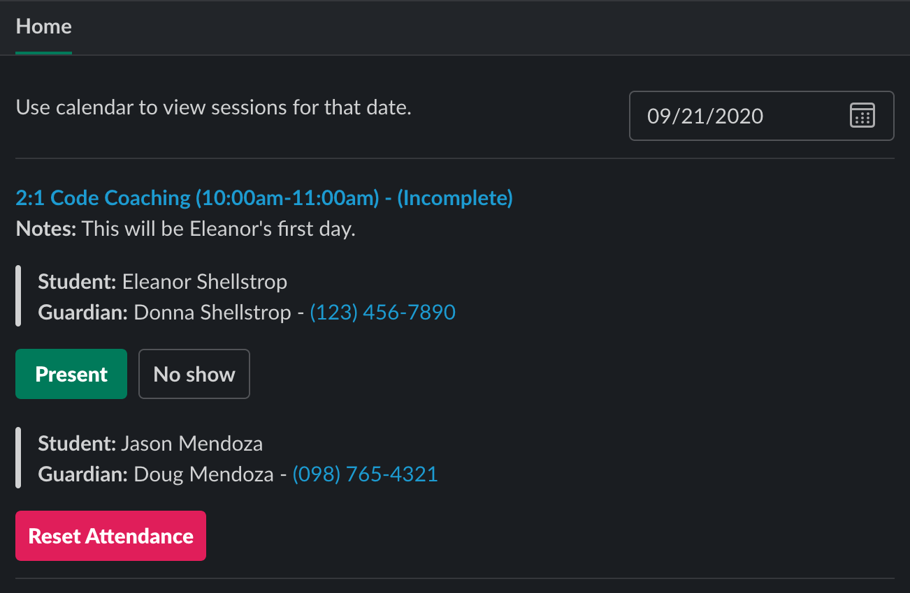

# TCS Attendance Marker (Slack App)

## About
A single workspace Slack App for use by employees of theCoderSchool. It allows for Code Coaches at to view their schedule on any given day and mark attendance of their students.

## Tech Stack
- Built using Slack's Bolt Framework (JavaScript)
- Work Data from Pike13 API
- Credentials on Redis
- Deployed on Google's App Engine